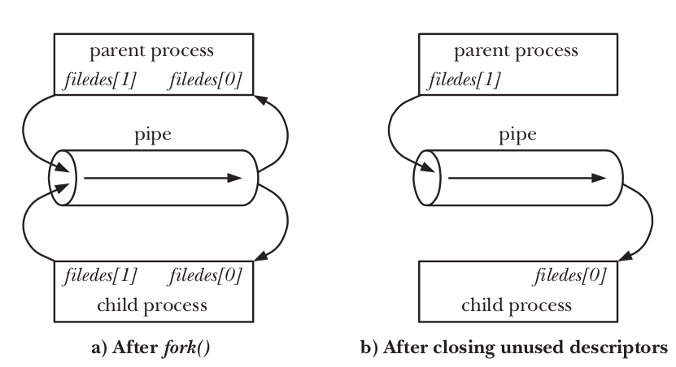

#+TITLE: My Notes For MIT 6.S081
#+OPTIONS: toc: 2
#+STARTUP: content

\\

** Table of Content :toc:
  - [[#lecture-1-inctroduction--examples][Lecture 1: Inctroduction & examples]]
  - [[#pipes--redirects][Pipes & Redirects]]

** Lecture 1: Inctroduction & examples
*** Core of Operating Systems

الـOS مبني علي 3 اعمدة رئيسية
- Virtualization
- Concurrency
- Persistence

  الـ3 مكونات دول هما اساس اي OS واللي هدفه الاساسي يحول الhardware الي بيئة
  سهلة وقوية للمستخدم والمبرمج.

-----

*** Purpose of OS

- Abstraction

بيجرد الhardware للراحة والسهولة في الاستخدام

- Isolation

بيعزل البرامج عن بعضها عشان يوفرلنا بيئة مستقرة, لو برنامج هنج مش هيأثر علي
برامج تانية ولا هيأثر علي الOS نفسه.

- Protection

بيحمي النظام من البرامج المشبوهة

- Performance & Efficiency

بيخلينا نستفيد من كامل قوة واداء الhardware ونفس الوقت بيحافظ علي استهلاك الطاقة
اذا كانت محدودة.

- Resource Managament

بيوزع موارد الجهاز علي كل البرامج بطريقة عادلة

*** Why studying OS is Hard/Interesting?
 - The developemnt enviornment is unforgiving because u deal directly with the hardware.
   - There is no abstractions, because ur the one who supposed to create that abstraction
*** Virtualization

الOS بياخد pyhsical resources زي (CPU, memory, disk) ويحولها لشكل افتراضي من
نفسها اكتر عمومية واقوي واسهل في الاستخدام. (Time sharing )

**** CPU Virtualization:

الOS بيوهم كل برنامج ان الCPU شغال ليه لوحده بينما في الحقيقة الOS بيخلي الCPU
يبدل بين البرامج بسرعة جدا فبنحس ان هما شغالين في نفس الوقت.

***** Simple Example of CPU Virtualization

#+BEGIN_SRC C :tangle ./code/cpu.c
  #include <unistd.h>
  #include <stdlib.h>
  #include <sys/time.h>
  #include <assert.h>
  #include "./common.h"

  int main(int argc, char *argv[]) {
      if (argc != 2) {
          fprintf(stderr, "usage: cpu <string>\n");
          exit(1);
      }
      char *str = argv[1];
      while(1) {
          Spin(1);
          printf("%s\n", str);
      }
  }
#+END_SRC

Results
#+BEGIN_SRC bash
  gcc -o cpu cpu.c -Wall
  ./cpu "A"
  A
  A
  A
  ^C
#+END_SRC

- Running many programs at once
#+BEGIN_SRC bash
  prompt> ./cpu A & ./cpu B & ./cpu C & ./cpu D &
  [1] 7353
  [2] 7354
  [3] 7355
  [4] 7356
  A
  B
  D
  C
  A
  B
  D
  C
  A
  ...
#+END_SRC

-----

**** Memeory Virtualization:

  الOS بيعمل address space وهمي لكل process وبيوهمها انها واخدة الmemory كلها
  لنفسها وده بيعمل isolation بين البرامج وبعضها فا بيخلي النظام اكثر امانا واستقرارا.

  ده غير انه بيسهل الامور علي المبرمج لانه بيتعامل مع الvirtual address space
  ومبيشلش هم التعامل مع الhardware الحقيقي.

***** Simple Example of Memory Virtualization

#+BEGIN_SRC c :tangle "./code/mem.c"
  #include <unistd.h>
  #include <stdio.h>
  #include <stdlib.h>
  #include "./common.h"

  int main(int argc, char *argv[]) {
      int *p = malloc(sizeof(int)); // a1
      assert(p != NULL);
      printf("(%d) address pointed to by p: %p\n", getpid(), p); // a2
      ,*p = 0;  // a3
      while(1) {
          Spin(1);
          ,*p = *p + 1;
          printf("(%d) p: %d\n", getpid(), *p);
      }
      return 0;
  }
#+END_SRC

- Results: here the two processes migh be accessing the same virtual memory
  address, but it maps to different pyhsical addresses in each of them,
  so it seem like each program has it's *isolated memory* and this what is called
  *Memory Virtualization*
#+BEGIN_SRC bash
  prompt> ./mem & ./mem &
  [1] 24113
  [2] 24114
  (24113) address pointed to by p: 0x200000
  (24114) address pointed to by p: 0x200000
  (24113) p: 1
  (24114) p: 1
  (24114) p: 2
  (24113) p: 2
  (24113) p: 3
  (24114) p: 3
  (24113) p: 4
  (24114) p: 4
  ...
#+END_SRC

-----

**** System Calls

 عشان المستخدم او المبرمج يقدر يتعامل مع الvirtual machine او الvirtual
 enviornment اللي الOS بيخلقها ويقدر يطلب منها اوامر, الOS بيوفر API Calls او
 ما يعرف بـ *Systems Calls* ودي الكوبري اللي بين الvirtual enviornment اللي
 مبنية فوق الhardware وبين الhardware الحقيقي.

 -----

**** Policies

الOS عنده Policies بتحدد مين يشتغل الاول ومين يستنا
الPolicies دي موجودة في جوانب كتير مش بس في الCPU Virtualization

-----

*** Concurreny

**** A Multi-threaded Program

#+BEGIN_SRC C :tangle ./code/threads.c
  #include <stdio.h>
  #include <stdlib.h>
  #include "./common.h"
  #include "./common_threads.h"

  volatile int counter = 0;
  int loops;

  void *worker(void *args) {
      for (int i = 0; i < loops; i++)
          counter++;
      return NULL;
  }

  int main(int argc, char *argv[]) {
      if (argc != 2) {
          fprintf(stderr, "usage: threads <value>\n");
          exit(1);
      }

      loops = atoi(argv[1]);
      pthread_t p1, p2;
      printf("Initial value: %d\n", counter);

      Pthread_create(&p1, NULL, worker, NULL);
      Pthread_create(&p2, NULL, worker, NULL);
      Pthread_join(p1, NULL);
      Pthread_join(p2, NULL);
      printf("Final value: %d\n", counter);
      return 0;
  }
#+END_SRC

Results:

هنا لو دخلنا رقم صغير, كل thread هيزود الcounter بشكل طبيعي بدون اي مشاكل

  #+BEGIN_SRC bash
    prompt> gcc -o threads threads.c -Wall -pthread
    prompt> ./threads 1000

    Initial value : 0
    Final value : 2000
  #+END_SRC

لكن لو دخلنا رقم كبير, هنلاحظ ان النتيجة غلط بل في كل مرة هنشغل البرنامج هناخد
نتيجة مختلفة, بل ممكن في مرة نحصل علي النتيجة الصحيحة

ده بيحصل لان عملية الincerement اللي في =counter++= مش *atomic* مع انها تبان
instruction واحدة الا انها في الحقيقة بتتكون من 3 instructions

1. fetch value from memory.

2. increment the value.

3. update the value in memory

   وكل thread بيعمل ال3 عمليات دول في كل iteration, فلما كبرنا الرقم, احتمالية
   ان الthreads تقاطع بعضها زادت, عشان كدا النتيجة مش بتطلع دقيقة.

  #+BEGIN_SRC bash
    prompt> gcc -o threads threads.c -Wall -pthread
    prompt> ./threads 10000

    Initial value : 0
    Final value : 9650
  #+END_SRC

*** Persistence

الOS بيوفرلنا software لادارة الملفات علي الجهاز, اسمه ال *file system*.

الDisk علي عكس الCPU و الMemory مفهموم الvirtualization هنا بيجي معني سهولة في
الاستخدام مش بمعني ان كل process شايفة private virtual disk خاص بيها لوحدها, كل
الprocesses بتتشارك في نفس الdisk والملفات, مفيش isolation هنا.

***** Example: A Program That Does I/O

#+BEGIN_SRC C :tangle ./code/io.c
  #include <stdio.h>
  #include <unistd.h>
  #include <assert.h>
  #include <fcntl.h>
  #include <sys/types.h>

  int main(int argc, char *argv[]) {
      int fd = open("/tmp/file", O_WRONLY|O_CREAT|O_TRUNC, S_IRWXU);
      assert(fd > -1);
      int rc = write(fd, "Hello world\n", 12);
      assert(rc == 12);
      close(fd);
      return 0;
  }
#+END_SRC

الOS بيخليك تتعامل مع الDisk بدون ما تتكلم معاه مباشرة وبدون ما تحتاج تعرف اصلا
ازاي تتكلم معاه. لان عشان تتكلم مع اي device وتطلب منه حاجة لازم تكون فاهم
الdevice ده كويس جدا وفاهم ازاي هو بيشتغل وازاي متصمم فهتلاقي نفسك محتاج تكتب
device driver للdisk عشان تتكلم معاه, لكن الOS بيجرد كل ده عنك وبيديك file
system سهل التعامل معاه.

*** Processes

الprocess هي عبارة عن running program, انما الprogram نفسه هو مجرد ملف موجود علي
الdisk ملوش لازمة الا لما تشغله.

الOS هو اللي بيحول الprogram من مجرد ملف الي process شغالة.

الProcess بتتكون من instruction + static data

*** Introduction to UNIX System Calls

- fork()
  - when we call fork() it will clone the address space of the *parent*, and
    create new process called *child*.
  - the parent and child has the same virtual address space but it maps to
    different pyhsical addresses, so they same to identical but they are two
    different processes.
#+BEGIN_SRC C :tangle ./code/fork.c
  #include <unistd.h>
  #include <stdio.h>
  #include <stdlib.h>
  #include <sys/wait.h>

  int main() {
      pid_t pid = fork();

      if (pid < 0)
          exit(1);
      if (pid > 0) {
          printf("parent: hello from parent\n");
          wait((int*) 0);
      } else {
          printf("child: hello from child\n");
          exit(1);
      }

      return 0;
  }
#+END_SRC

- exec()
  - the exec() function overrites the address space of the current process with
    the data and instruction of the new executable
  - it doesn't return to main() function again, unless an error occurred.
  - by convention it ignores the first string in the argv, because it doesn't to
    know the name of the executable when have the executable itself.
#+BEGIN_SRC C :tangle ./code/exec.c
  #include <unistd.h>
  #include <stdlib.h>
  #include <stdio.h>

  int main() {
       // change "echo" to "bla bla" and it will still work fine.
      char *argv[] = {"echo", "hello", 0};
      execv("/bin/echo", argv);
      fprintf(stderr, "exec error");
  }
#+END_SRC

#+RESULTS:
: hello

** Pipes & Redirects
*** The low-level idea behind them

- لما بنفتح ملف باستخدام =open()= بيتعمل حاجتين:
  1. في الmemory space بتاعت الprocess بيتعمل FD Table.
  2. في الkernel بيتعمل Open File Descriptions في الOpen File Table.

#+BEGIN_EXAMPLE
PROCESS A (FD Table)          OPEN FILE TABLE            INODE/VNODE TABLE
    +-----------------------+     +----------------------+      +-------------------+
    | Index (FD) | Pointer  |     |  Flags, Offset, Ptr  |      | File Metadata/Ops |
    |------------|----------|     |----------------------|      |-------------------|
    |   fd = 0   |    *-----+---->| [ Flags | * ]--------+--+-->| Inode: /dev/pts/0 |
    |------------|----------|     +----------------------+  |   | (Terminal)        |
    |   fd = 1   |    *-----+---->| [ Flags | * ]--------+--+   +-------------------+
    |------------|----------|     +----------------------+  |
    |   fd = 2   |    *-----+---->| [ Flags | * ]--------+--+
    |------------|----------|     +----------------------+      +-------------------+
    |   fd = 3   |    *-----+---->| [ Flags | * ]--------+----->| Inode: data.txt   |
    +-----------------------+     +----------------------+      | (On Disk)         |
                                                                +-------------------+
#+END_EXAMPLE

- FD Table:

  - جدول بسيط جواه الProcess بيخزن entries كل entry فيها index و pointer,
    الindex هو مجرد id للملف داخل الprocess. والpointer بيشاور علي الopen file
    description الخاص بالملف ده في الkernel

- Open File Table

  - دي centralized table في الkernel بيتخزن فيها الstate بتاعت كل الملفات المفتوحة علي مستوي الOS كله

  - كل ملف مفتوح بيبقي ليه record في الtable دي

- Open File Description:

  - ده الobject الحقيقي في الkernel, فيه الstate بتاعت الملف (reference count, offset, flags, ...)
  - ممكن يشاور عليه file descriptors مختلفة من اي process شغالة (reference count - shared pointers)

-----

- دالة =open()= بتعمل open file descriptor جديد كل مرة, فا ممكن تفتح نفس الملف كذا
  مرة ولكن بstate مختلفة.
  - سواء fd3 و fd4 ولكن كل واحد بيشاور علي open file descriptor مختلف
  - ال =dup()= ممكن تخلي كذا fd مختلف يشاور علي نفس الopen file descriptor في الkernel

#+BEGIN_SRC C
// the same file opened two times
int fd3 = open("file.txt", O_RDONLY); // description جديدة
int fd4 = open("file.txt", O_RDONLY); // description تانية مستقلة

int fd5 = dup(fd3);
#+END_SRC

-----

*** Another important info

- الfd الجديد ديما بياخد *اصغر* رقم متاح
- اغلب الposix/unix utilies مصممة انها تقرأ من الstdin لو ما اتبعتلهاش argument محددة

-----

*** Redirects

لما في الshell بتعمل =cat < input.txt=

1. الshell بيعمل fork لprocess جديدة.
2. بيقفل الstdin, فا كدا رقم 0 بقا متاح
3. بيفتح الملف اللي احنا هنبعته, والfd بتاعه هياخد رقم 0 (المفروض)
4. بينادي علي الcat executable وهو هيقرا من الملف

#+BEGIN_SRC C
char *argv[2] = {"cat", 0};

if (fork() == 0) {
    close(0);
    open("input.txt", O_RDONLY);
    exec("cat", argv);
}
#+END_SRC

-----

*** dup()

- الdup() بترجع fd جديد بيشاور علي نفس الopen file description اللي بيشاور عليه الfd القديم, فا كدا بقا عندنا 2 fd بيشاورا علي نفس الobject في الkernel, يعني الref count بتاع الobject ده بيقا 2

- الopen file description في الkernel بيبقا ليه ref count, والkernel عمره ما هيقفل الobject ده الا لما الref count يبقي ب0 (shared pointer)

#+begin_src C
int savestdin = dup(0); // cloned the open file desc of stdin in a new fd
#+end_src

-----

*** dup2()

- الdup2() تختلف عن dup() في حاجات بسيطة ولكنها مهمة
- *اولا* بدل مكان الkernel هو اللي بيحدد الfd الجديد زي في dup(), لا, احنا اللي بنحدد الfd الجديد اللي هيتشارك مع الfd القديم في نفس الofd
- *ثانيا* عمليه الduplication بتحصل بطريقة *Atomic* وده اهم ما فيها
  - عمليه الduplication بتتم في خطوات كتير جدا
    1. فحص هل الnew fd مفتوح اصلا ولا لا؟
    2. فحص هل هو الnew fd هو نفس الold fd ولا لا
    3. قفل الملف اللي كان محجوز في الnew fd
    4. نسخ الopen file description

- ودي خطوات كتير اوي وممكن يتم مقاطعتها في النص, وهنرجع لنفس مشكلة الthread safety اللي كود الredirect
- ولكن dup2 بتعمل كل دا في خطوة واحدة

#+begin_src C
dup2(savestdin, 0); // clone 'savestdin' to stdin
#+end_src

-----

*** Thread-safe Redirection

- مثال علي thread unsafe redirection
  1. بنقفل الstdin عشان نستخدم الfd 0 للملف بتاعنا
  2. بنفتح الملف اللي عاوزينه ياخد الfd 0, بس هنا ممكن thread تانية تكون فتحت ملف جديد قبلنا, وفي الحالة دي الthread التاني هيكون خد مننا الfd 0 والthread الاولي هتاخد رقم تاني ومن هنا هتحصل بلاوي كتير

- Non thread-safe example:
#+BEGIN_SRC C
if (fork() == 0) {
    close(0);
    open("input.txt", O_RDONLY);
    exec("cat", argv);
}
#+END_SRC

- Thread-safe example: طريقة اكثر احترافية وامان
#+begin_src C
if (fork() == 0) {
    int fd = open("input.txt", O_RDONLY);
    dup2(fd, 0); // atomic duplication
    close(fd); // we dont need it anymore
    exec("cat", argv);
}
#+end_src

-----

*** Pipes (Anonymous Pipe)

الpipe هي ماسورة نقل بيانات بين الprocesses او i/o byte stream , بتنقل البيانات في خط احادي (unidirectional).

الاستخدام الاشهر للpipes هو اننا نخلي الoutput بتاع process يبقي الinput بتاع process تانية او بمعني اخر بنربط الstdout بتاع اول process بstdin بتاع ثاني process.
[[file:images/2026-05-13_06-38-19_screenshot.png]]

الinterface:
=int pipe(int fd[2])= الpipe بترجع 2 file descriptors بيمثلوا طرفين الماسورة, fd[0] بيعبر عن الread end و fd[1] بيعبر عن الwrite end.

ولكن الfds دي مش بتmap لfiles علي الdisk, الpipe اصلا هو عبارة عن buffer في الmemory بتاعت الkernel.

بيبقي ليه حجم ثابت ولو اتملأ (يعني الprocess اللي بتكتب بعتت داتا كتير) الprocess دي مش هتعرف تبعت داتا تاني لحد ما الprocess اللي بتقرا تسحب شوية داتا عشان تفضي مكان.

الkernel بيحدد برضو buffer تاني اسمه الPIPE_BUF وده الbuffer اللي بننقل بيه الداتا من الbuffer الكبير (pipe) خلال الماسورة, يعني نقدر نعتبره المغرفة اللي بننقل بيها الداتا, الPIPE_BUF ده ليه حجم ثابت برضو غالبا بيبقي 4kb ولو الداتا اللي بتتنقل اصغر من الحجم ده, هتتنقل كتلة واحدة *atomic*.

----

- Simple Example

#+begin_src c :tangle ./code/pipe.c
#include <stdio.h>
#include <unistd.h>

int main()
{
    int pfd[2];
    pipe(pfd); // Creating the pipe.

    if (fork() > 0) {
        close(pfd[0]); // Closing the read end
        write(pfd[1], "msg", 4);
        close(pfd[1]); // Closing the write end
    } else {
        char buf[4];
        close(pfd[1]); // Closing the write end
        read(pfd[0], buf, 4);
        printf("%s", buf); // msg
        close(pfd[0]); // Closing the read end
    }
    return 0;
}
#+end_src

#+RESULTS:
: msg

-----

- Real world example

  #+begin_src bash
ls | grep string
  #+end_src

  - لو grep اشتغل قبل ls, هيفضل في حالة blocking لحد ما ls يكتب داتا, او لحد ما الfd[0] يتقفل.

#+begin_src c
//  parent: shell

int fd[2];
pipe(fd);

// child: ls
if (fork() == 0) {
    close(fd[0]);
    dup2(fd[1], 1); // map the stdout of the 'ls' process to the write end
    exec("/bin/ls", args);
    exit(0);
}

// child: grep
if (fork() == 0) {
    close(fd[1]);
    dup2(fd[0], 0); // map the stdin of the 'grep' process to the read end
    exec("/bin/grep", args);
    exit(0);
}

// clear the zombie processes
wait(NULL);
wait(NULL);

// close the original fd[2], to terminate the pipe and prevent grep,
// from waiting for ever because it thinks that the read stream still going
close(fd[0]);
close(fd[1]);

#+end_src

-----

- ملحوظة الpipe ممكن تشتغل كا bidirectional عادي, لكن هيحصل مشاكل deadlocks و race conditions, فا دا مش محبب

#+begin_src C
#include <stdio.h>

#include <unistd.h>
#include <sys/wait.h>
#include <stdlib.h>

int main() {
    int pfd[2];
    pipe(pfd); // Creating the pipe.

    if (fork() > 0) {
        char buf[4];
        write(pfd[1], "msg\0", 4);
        wait(0);
        read(pfd[0], buf, 4);
        printf(buf);
        exit(0);
    } else {
        char buf[4];
        read(pfd[0], buf, 4);
        printf(buf);
        write(pfd[1], "zoz", 4);
        exit(0);
    }
    return 0;
}
#+end_src

# Local Variables:
# eval: (olivetti-mode 1)
# End:
